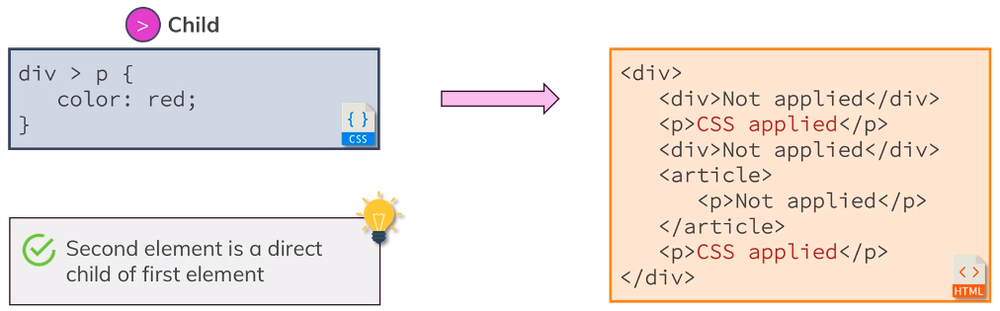
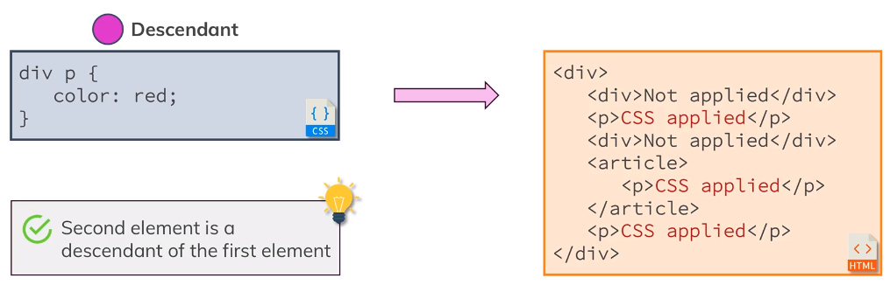
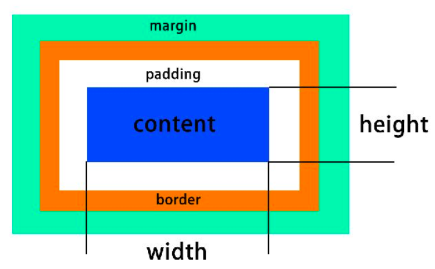
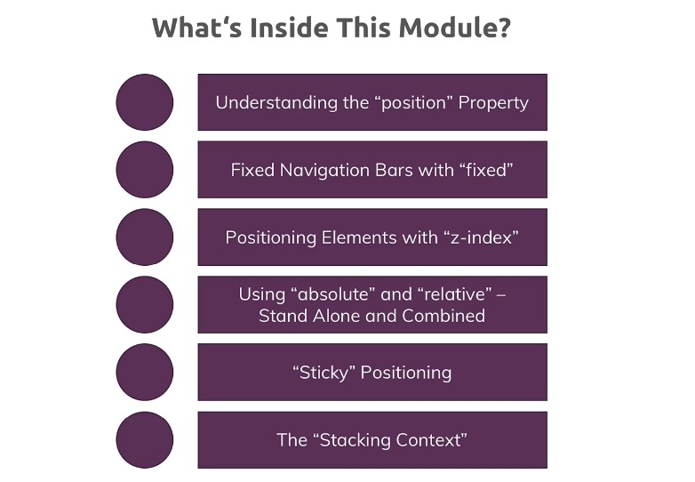
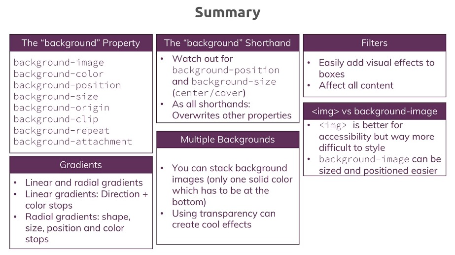
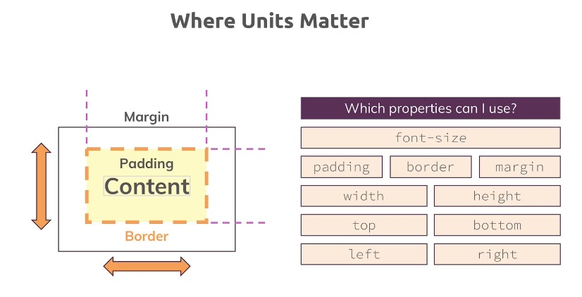

# CSS

## _Section 1 Basice of Css_

### Add CSS

**Inline**
```CSS
<h1 style="color:blue">
  Hello World!
</h1>
```

**Outline**  
Add `<style>` Tag, in `<head>` section.

```CSS
<style>
  h1 {
    color: maroon;
  }
</style>
```

**External**  
Defined within the `<link>`, in `<head>` section.

```CSS
<head>
  <link rel="stylesheet" type="text/css" href="main.css">
</head>
```

#

### Selector

**Elements**

```CSS
h1 {
  color: maroon;
}
```

**Classes**

```CSS
.class-name {
  color: maroon;
}
```

only `<p>` elements with class="center" will be center-aligned

```CSS
p.center {
  text-align: center;
  color: red;
}
```

**Universal**

```CSS
* {
  color: red;
}
```

**_id_**

```CSS
#id-name {
  color: red;
}
```

**_Attributes_**

```CSS
[disabled] {
  color: red;
}
```

**Specificity**


#

### Inheritance/Combinators

#### Inherit

```CSS
.class-name {
  font:inherit;
}
```

#### Combinators

example

```CSS
#id-name h1 {
  font-family: sans-serif;
}
```

**Adjacent Sibling**

```CSS
div + p {

}
```

Second element have to come **immediately** after first element  


**General Sibling**

```CSS
div ~ p {

}
```


**Child**

```CSS
div > p {

}
```



**Descendant**

```CSS
div p {

}
```



#

---
## _Section 2 Box Model_

### Box Model



**margin**  
Understand [Margin Collapsing](https://developer.mozilla.org/en-US/docs/Web/CSS/CSS_Box_Model/Mastering_margin_collapsing), and carefull with the **Default Margins**.

**border**

**padding**

**content**

#
**Separate & Shorthand Properties**


#

**Height & Width Properties**  
!!!!!!!

```CSS
width: calc(100% - 50px);
```

\*_carefull the whitespace you have in the editor here._

#
### Boxing Sizing 
When we set the width and height of the content. the size in the html page will plus the padding, the border or of the content.  
We can use `box-sizing: border-box;` to set the total size.

_margin is never included_

_for inline element, margin/padding/border top and bottom don't have an effect_


#

### font-weight & border

Need understand `border-image`.


#

---
## _Section 3 More on Css_

### Display Property

`display: none`  
`display: block`;  
`display: inline`;  
`display: inline-block` (can set up height, width, padding, margin)

**display: none vs visibility: hidden**  
If you only want to hide an element but you want to keep its place (i.e. other elements don't fill the empty spot), you can use `visibility: hidden`;

#

### text-decoration & vertical-align

text-decoration: text style

vertical-align: position, like text-top, text-buttom

Check more info from MDN

#

### so-called pseudo classes

[Pseudo Classes](https://developer.mozilla.org/en-US/docs/Web/CSS/Pseudo-classes) & [Pseudo Elements](https://developer.mozilla.org/en-US/docs/Web/CSS/Pseudo-elements)


(.classname:nth-of-type(2) {
  xxx:xxx
} )

#

### Grouping Rules

```CSS
.main-nav-item a:hover{
  color:white;
}
.main-nav-item a:active{
  color:white;
}
```

```CSS
.main-nav-item a:hover,
.main-nav-item a:active {
  color:white;
}
```

#

### About button

_border-radius_


```CSS
.main-nav-item-cta a{
  border-radius: 8px;
}
```
[border-radius_MDN](https://developer.mozilla.org/en-US/docs/Web/CSS/border-radius)

_cursor_  

```CSS
.button{
  cursor: pointer;
}
```
[cursor_W3C](https://www.w3schools.com/cssref/pr_class_cursor.asp)

#

### Adding image in CSS

\*other section will explain more  
[Section 7 Background](#Section-7-Background)

```CSS
#section-one {
  background: url("freedom.jpg");
  width: 100%;
  height: 300px;
}
```

#

### ~~Properties worth to remember~~

#

---

## _Section 4 More on Selectors_

#

### Multiple selector

Understand Different between `a.cative` and `a .active`

```html
<a href="#idname" class="name1 name2"></a>
```

#

### Use class or ID?


Id also allows you link on a page

#

### pseudo-class :not()
```css
/* Selects any element that is NOT a paragraph */
:not(p) {
  color: blue;
}
```

#
--- 

## _Section 5 More On Css_

### Browser Support

[Can I use](https://caniuse.com/)

#

### Box-Shadow


[Box-Shadow-cn](https://www.jianshu.com/p/2bd56a32de59)

#

### Understand Outlines
Browser have the default color.
```CSS
.plan-button:focus{
  outline: none;
}
```

#

### So-called float

```CSS
#free {
  float: right;
}
```

Try not use this, or add a `<div>` with flowing Css after a positioning elements.

```CSS
.clearfix {
  clear: both;
}
```

This is a hacky way, use different things like flex box.

#

---

## _Section 6 Position_



### Position

Position:

- static (Default)
- absolute
- relative
- fixed
- sticky

#

### fixed

fixed changed the positioning context to viewport.

```CSS
.main-header {
  width: 100%;
  position: fixed;
  top: 0;
  left: 0;
}
```

#

### z-index

```CSS
.background {
  background: url("../images/plans-background.jpg");
  width: 100%;
  height: 100%;
  position: fixed;
  z-index: -10;
}
```

\*other section will explain more
[Section 7 Background](#Section-7-Background)

#

### absolute

fixed changed the positioning context to viewport.

absolute also take out of the document flow, but is base on the HTML element(top,left,bottom,right setting), If you don't have any ancestors with a positioning property applied.

#

### relative

parent element basically.

！carefull with the overflow(in html and body element) and relative positioning

#

### sticky

understand how it works first.

similar like fixed, but base on the element.
Sticky not support all brower. check [CanIuse](https://caniuse.com/) before you use.

#

---

## _Section 7 Background_

- Understand "background" Property
- image
- Gradients
- Filters

#

### background image

```CSS
.background {
  /* background: url("../images/plans-background.jpg"); */
  background-image: url("../images/plans-background.jpg");
  width: 100%;
  height: 100%;
  position: fixed;
}
```

#

### Size

basic declaration

```CSS
.background {
  background-image: url("../images/plans-background.jpg");
  background-size: 200px 100px;
  background-size: 100%;
  background-repeat: no-repeat;
  background-repeat: repeat-x;
  background-repeat: repeat-y;
  width: 100%;
  height: 100%;
  position: fixed;
}
```

special declaration

```CSS
.background {
  background-image: url("../images/plans-background.jpg");
  background-size: cover;
  background-size: contain;
  background-repeat: no-repeat;
  width: 100%;
  height: 100%;
  position: fixed;
}
```

#

### Position

basic declaration  
`background-position: x-axis y-axis;`

```CSS
.background {
  background-image: url("../images/plans-background.jpg");
  background-size: cover;
  background-position: 20px 50px;
  background-position: 0% 0%;
  background-position: left 10% bottom 10%;
  background-repeat: no-repeat;
  width: 100%;
  height: 100%;
  position: fixed;
}
```

#

### Origin/Clip/attachment

basic declaration

```CSS
.background {
  background-image: url("../images/plans-background.jpg");
  background-position: left 10% bottom 10%;
  background-size: cover;
  background-origin: content-box;
  background-origin: border-box;
  background-origin: padding-box;

  background-clip: content-box;
  background-clip: border-box;
  background-clip: padding-box;
  background-repeat: no-repeat;
  width: 100%;
  height: 100%;
  position: fixed;
}
```

shorthand

```CSS
.background {
  background-image: url("../images/plans-background.jpg") left 10% bottom 20%/cover no-repeat border-box;
  /* background-position: left 10% bottom 10%;
  background-size: cover;
  background-repeat: no-repeat;
  background-origin: border-box;
  background-clip: padding-box; */
  width: 100%;
  height: 100%;
  position: fixed;
}
```

#

### Anchor tab with image

This is important to understand, with using images it depends on whether you use it nested in an inline element, in which case 100% will simply use the default dimension, the default or height of the image  
Or if you use it inside a block level element where it will use the container width or height.

```CSS
.main-header__brand {
  height: 22px;
  /* width: 20px; */
  display: inline-block;
}

.main-header__brand img {
  height: 100%;
  /* width: 100%; */
}
```

Try using `background-image`, the better way!!

#

### linear Gradient
also can use cubic-bezier, like `cubic-bezier(0.25, 0.46, 0.45, 0.94)`

Example:

```CSS
#product-overview {
  /* background: url("freedom.jpg"); */
  background-image: linear-gradient(red, blue, yellow);
  background-image: linear-gradient(to left top, red, blue);
  background-image: linear-gradient(180deg, red, blue);
  background-image: linear-gradient(180deg, red 70%, transparent);
  width: 100%;
  height: 528px;
  padding: 10px;
}
```

#

### radial Gradient

Example:

```CSS
#product-overview {
  /* background: url("freedom.jpg"); */
  background-image: radial-gradient(red, blue, yellow);
  background-image: radial-gradient(circle, red, blue);
  background-image: radial-gradient(circle at top left, red, blue);
  width: 100%;
  height: 528px;
  padding: 10px;
}
```

Please check [MDN](https://developer.mozilla.org/en-US/) for more property and property value.


#

### Filters

Please check [MDN-Filter](https://developer.mozilla.org/en-US/docs/Web/CSS/filter) for more property and property value.

#

### Adding styling 　 SVGs

**clip-path**
```css
.clip{
  background-color:red;
  height:300px;
  width:500px;
  clip-path: polygon(0 0, 100% 0, 100% 80%, 0 100%);
}
```
Please check [clip-path](https://developer.mozilla.org/en-US/docs/Web/CSS/clip-path) for more property and property value.  


**SVGs**  
Please check [MDN-SVG](https://developer.mozilla.org/en-US/docs/Web/SVG/Tutorial/SVG_and_CSS) for more property and property value.

#



#

---

## _Section 8 Sizes and Units_


#

### What properties need size




#

### What properties need size


#

### What properties need size


### three Rules to remember with '%'

Fixed positioning  
The containing block is the viewport.

Absolute Positioning  
Ancestor(content + padding)

Relative/Static Positioning  
Ancestor(content) -->

#

### Height with 100% issue

If not working check the default height in `<html> and <body>`

#

### max-width/height and min-width/height

\*other section will explain more, in [response design section](#Section-10-Responsive-Design)

#

### rem and em

1em = 16px

#


