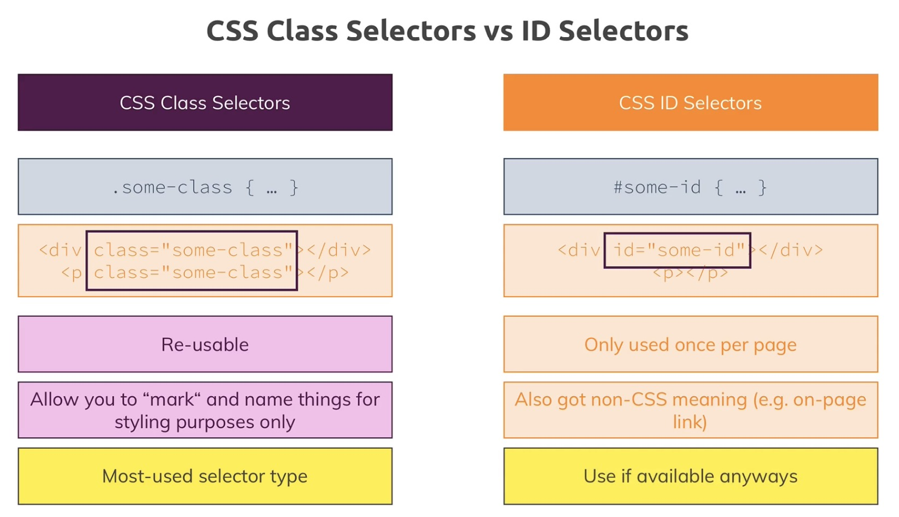
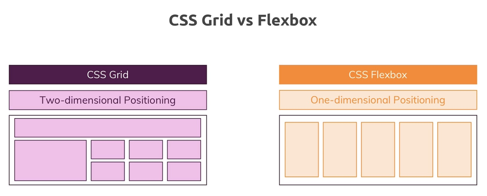

# Projects

Front-end note by Max

- [1. _Section 1 Basice of Css_](#1-section-1-basice-of-css)
  - [1.1. Add CSS](#11-add-css)
  - [1.2. Selector](#12-selector)
  - [1.3. Inheritance/Combinators](#13-inheritancecombinators)
    - [1.3.1. Inherit](#131-inherit)
    - [1.3.2. Combinators](#132-combinators)
- [2. _Section 2 Box Model_](#2-section-2-box-model)
  - [2.1. Box Model](#21-box-model)
  - [2.2. Boxing Sizing](#22-boxing-sizing)
  - [2.3. font-weight & border](#23-font-weight--border)
- [3. _Section 3 More on Css_](#3-section-3-more-on-css)
  - [3.1. Display Property](#31-display-property)
  - [3.2. text-decoration & vertical-align](#32-text-decoration--vertical-align)
  - [3.3. so-called pseudo classes](#33-so-called-pseudo-classes)
  - [3.4. Grouping Rules](#34-grouping-rules)
  - [3.5. About button](#35-about-button)
  - [3.6. Adding image in CSS](#36-adding-image-in-css)
  - [3.7. ~~Properties worth to remember~~](#37-properties-worth-to-remember)
- [4. _Section 4 More on Selectors_](#4-section-4-more-on-selectors)
  - [4.1. Multiple selector](#41-multiple-selector)
  - [4.2. Use class or ID?](#42-use-class-or-id)
  - [4.3. pseudo-class :not()](#43-pseudo-class-not)
- [5. _Section 5 More On Css_](#5-section-5-more-on-css)
  - [5.1. Browser Support](#51-browser-support)
  - [5.2. Box-Shadow](#52-box-shadow)
  - [5.3. Understand Outlines](#53-understand-outlines)
  - [5.4. So-called float](#54-so-called-float)
- [6. _Section 6 Position_](#6-section-6-position)
  - [6.1. Position](#61-position)
  - [6.2. fixed](#62-fixed)
  - [6.3. z-index](#63-z-index)
  - [6.4. absolute](#64-absolute)
  - [6.5. relative](#65-relative)
  - [6.6. sticky](#66-sticky)
- [7. _Section 7 Background_](#7-section-7-background)
  - [7.1. background image](#71-background-image)
  - [7.2. Size](#72-size)
  - [7.3. Position](#73-position)
  - [7.4. Origin/Clip/attachment](#74-originclipattachment)
  - [7.5. Anchor tab with image](#75-anchor-tab-with-image)
  - [7.6. linear Gradient](#76-linear-gradient)
  - [7.7. radial Gradient](#77-radial-gradient)
  - [7.8. Filters](#78-filters)
  - [7.9. Adding styling SVG](#79-adding-styling-svg)
- [8. _Section 8 Sizes and Units_](#8-section-8-sizes-and-units)
  - [8.1. What properties need size](#81-what-properties-need-size)
  - [8.2. three Rules to remember with '^^'](#82-three-rules-to-remember-with-^^)
  - [8.3. Height with 100^^ issue](#83-height-with-100^^-issue)
  - [8.4. max-width/height and min-width/height](#84-max-widthheight-and-min-widthheight)
  - [8.5. rem and em](#85-rem-and-em)
  - [8.6. vw and vh](#86-vw-and-vh)
  - [8.7. Windows, Viewport Units & Scrollbars](#87-windows-viewport-units--scrollbars)
  - [8.8. Choosing the Right Unit](#88-choosing-the-right-unit)
- [9. _Section 9 JS and CSS_](#9-section-9-js-and-css)
  - [9.1. JS can change display value](#91-js-can-change-display-value)
- [10. _Section 10 Responsive Design_](#10-section-10-responsive-design)
  - [10.1. Hardware vs Software Pixels](#101-hardware-vs-software-pixels)
  - [10.2. `<meta>` tag in HTML](#102-meta-tag-in-html)
  - [10.3. Media Queries with @media](#103-media-queries-with-media)
- [11. _Section 11 Advanced Attribute Selectors_](#11-section-11-Advanced-Attribute-Selectors)
  - [11.1. Advanced Attribute Selectors](#111-advanced-attribute-selectors)
  - [11.2. Built-in element (Checkbox)](#112-built-in-element-checkbox)
- [12. _Section 12 More about Fonts_](#12-section-12-more-about-fonts)
  - [12.1. About fonts](#121-about-fonts)
  - [12.2. Letter-spacing & Line Heigt](#122-letter-spacing--line-heigt)
  - [12.3. text-decoration & text-shadow](#123-text-decoration--text-shadow)
  - [12.4. Shorthand](#124-shorthand)
  - [12.5. font-display](#125-font-display)
- [13. _Section 13 Flexbox_](#13-section-13-flexbox)
  - [13.1. Flexbox](#131-flexbox)
  - [13.2. Main axis vs Cross Axis](#132-main-axis-vs-cross-axis)
  - [13.3. Some Properties](#133-some-properties)
- [14. _Section 14 Css Grid_](#14-section-14-css-grid)
  - [14.1. CSS Grid](#141-css-grid)
  - [14.2. defining columns & rows](#142-defining-columns--rows)
  - [14.3. posotioning child elements in Grid](#143-posotioning-child-elements-in-grid)
  - [14.4. Gaps between column or row / template areas](#144-gaps-between-column-or-row--template-areas)
  - [14.5. some propertis](#145-some-propertis)
  - [14.6. 
flow](#146-
flow)
  - [14.7. Dense Grid](#147-dense-grid)
  - [14.8. Flexbox vs. CSS Grid](#148-flexbox-vs-css-grid)
- [15. _Section 15 Css Transforms_](#15-section-15-css-transforms)
  - [15.1. Rotating](#151-rotating)
  - [15.2. skew and scale](#152-skew-and-scale)
  - [15.3. D  dimension](#153-d--dimension)
  - [15.4. perspective](#154-perspective)
  - [15.5. translate](#155-translate)
  - [15.6. transform-style](#156-transform-style)
  - [15.7. backface-visibility](#157-backface-visibility)
- [16. _Section 16 Transitions and Animations_](#16-section-16-transitions-and-animations)
  - [16.1. transitions](#161-transitions)
  - [16.2. Timing Functions](#162-timing-functions)
  - [16.3. animations](#163-animations)
  - [16.4. multiple Keyframes](#164-multiple-keyframes)
- [17. _Section 17 Future-proof Css_](#17-section-17-future-proof-css)
  - [17.1. CSS Variables](#171-css-variables)
  - [17.2. Vendor Prefixes](#172-vendor-prefixes)
  - [17.3. Name css class](#173-name-css-class)
  - [17.4. Vanilla CSS vs Frameworks](#174-vanilla-css-vs-frameworks)
- [18. _Section 18 Sass_](#18-section-18-sass)
  - [18.1. Scss and Sass](#181-scss-and-sass)
  - [18.2. Nesting](#182-nesting)
  - [18.3. Variables](#183-variables)
  - [18.4. Built-In Functions](#184-built-in-functions)
  - [18.5. Inheritance](#185-inheritance)
  - [18.6. Mixins](#186-mixins)
  - [18.7. Ampersand Operator](#187-ampersand-operator)
  - [18.8. Useful Resources](#188-useful-resources)


# CSS

Using [BEM](#173-name-css-class).  
Designing Websites "Mobile First".

Testing:  
Different PC system, browser, browser font size.  
Default height, weight, marging, padding.(in `<html>, <body>`)

---
## 1. _Section 1 Basice of Css_

### 1.1. Add CSS

**Inline**
```CSS
<h1 style="color:blue">
  Hello World!
</h1>
```

**Outline**  
Add `<style>` Tag, in `<head>` section.

```CSS
<style>
  h1 {
    color: maroon;
  }
</style>
```

**External**  
Defined within the `<link>`, in `<head>` section.

```CSS
<head>
  <link rel="stylesheet" type="text/css" href="main.css">
</head>
```

#

### 1.2. Selector

**Elements**

```CSS
h1 {
  color: maroon;
}
```

**Classes**

```CSS
.class-name {
  color: maroon;
}
```

only `<p>` elements with class="center" will be center-aligned

```CSS
p.center {
  text-align: center;
  color: red;
}
```

**Universal**

```CSS
* {
  color: red;
}
```

**_id_**

```CSS
#id-name {
  color: red;
}
```

**_Attributes_**

```CSS
[disabled] {
  color: red;
}
```

**Specificity**


#

### 1.3. Inheritance/Combinators

#### 1.3.1. Inherit

```CSS
.class-name {
  font:inherit;
}
```

#### 1.3.2. Combinators

example:

```CSS
#id-name h1 {
  font-family: sans-serif;
}
```

**Adjacent Sibling**

```CSS
div + p {

}
```

Second element have to come **immediately** after first element  


**General Sibling**

```CSS
div ~ p {

}
```


**Child**

```CSS
div > p {

}
```


**Descendant**

```CSS
div p {

}
```


#

---
## 2. _Section 2 Box Model_

### 2.1. Box Model


**margin**  
Understand [Margin Collapsing](https://developer.mozilla.org/en-US/docs/Web/CSS/CSS_Box_Model/Mastering_margin_collapsing), and carefull with the **Default Margins**.

**border**

**padding**

**content**

#
**Separate & Shorthand Properties**


#

**Height & Width Properties**  
!!!!!!!

```CSS
width: calc(100% - 50px);
```

\*_carefull the whitespace you have in the editor here._

#
### 2.2. Boxing Sizing 
When we set the width and height of the content. the size in the html page will plus the padding, the border or of the content.  
We can use `box-sizing: border-box;` to set the total size.

_margin is never included_

_for inline element, margin/padding/border top and bottom don't have an effect_


#

### 2.3. font-weight & border

Need understand `border-image`.

```html
<fieldset>
  <legend>
  </legend>
</fieldset>
```

#

---
## 3. _Section 3 More on Css_

### 3.1. Display Property

`display: none`  
`display: block`;  
`display: inline`;  
`display: inline-block` (can set up height, width, padding, margin)

**display: none vs visibility: hidden**  
If you only want to hide an element but you want to keep its place (i.e. other elements don't fill the empty spot), you can use `visibility: hidden`;

#

### 3.2. text-decoration & vertical-align

text-decoration: text style

vertical-align: position, like text-top, text-buttom

Check more info from MDN

#

### 3.3. so-called pseudo classes

[Pseudo Classes](https://developer.mozilla.org/en-US/docs/Web/CSS/Pseudo-classes) & [Pseudo Elements](https://developer.mozilla.org/en-US/docs/Web/CSS/Pseudo-elements)

like: `before`,`after`

(.classname:nth-of-type(2) {
  xxx:xxx
} )


#

### 3.4. Grouping Rules

```CSS
.main-nav-item a:hover{
  color:white;
}
.main-nav-item a:active{
  color:white;
}
```

```CSS
.main-nav-item a:hover,
.main-nav-item a:active {
  color:white;
}
```

#

### 3.5. About button

_border-radius_


```CSS
.main-nav-item-cta a{
  border-radius: 8px;
}
```
[border-radius_MDN](https://developer.mozilla.org/en-US/docs/Web/CSS/border-radius)

_cursor_  

```CSS
.button{
  cursor: pointer;
}
```
[cursor_W3C](https://www.w3schools.com/cssref/pr_class_cursor.asp)

#

### 3.6. Adding image in CSS

\*other section will explain more  
[Section 7 Background](#Section-7-Background)

```CSS
#section-one {
  background: url("freedom.jpg");
  width: 100%;
  height: 300px;
}
```

#

### 3.7. ~~Properties worth to remember~~

#

---

## 4. _Section 4 More on Selectors_

#

### 4.1. Multiple selector

Understand Different between `a.cative` and `a .active`

```html
<a href="#idname" class="name1 name2"></a>
```

#

### 4.2. Use class or ID?



Id also allows you link on a page

#

### 4.3. pseudo-class :not()
```css
/* Selects any element that is NOT a paragraph */
:not(p) {
  color: blue;
}
```
[3.3. so-called pseudo classes](#33-so-called-pseudo-classes)

#
--- 

## 5. _Section 5 More On Css_

### 5.1. Browser Support

[Can I use](https://caniuse.com/)

#

### 5.2. Box-Shadow


[Box-Shadow-cn](https://www.jianshu.com/p/2bd56a32de59)

#

### 5.3. Understand Outlines
Browser have the default color.
```CSS
.plan-button:focus{
  outline: none;
}
```

#

### 5.4. So-called float

```CSS
#free {
  float: right;
}
```

Try not use this, or add a `<div>` with flowing Css after a positioning elements.

```CSS
.clearfix {
  clear: both;
}
```

This is a hacky way, use different things like flex box.

#

---

## 6. _Section 6 Position_


### 6.1. Position

Position:

- static (Default)
- absolute
- relative
- fixed
- sticky

#

### 6.2. fixed

fixed changed the positioning context to viewport.

```CSS
.main-header {
  width: 100%;
  position: fixed;
  top: 0;
  left: 0;
}
```

#

### 6.3. z-index

```CSS
.background {
  background: url("../images/plans-background.jpg");
  width: 100%;
  height: 100%;
  position: fixed;
  z-index: -10;
}
```

\*other section will explain more
[Section 7 Background](#Section-7-Background)

#

### 6.4. absolute

fixed changed the positioning context to viewport.

absolute also take out of the document flow, but is base on the HTML element(top,left,bottom,right setting), If you don't have any ancestors with a positioning property applied.

#

### 6.5. relative

parent element basically.

！carefull with the overflow(in html and body element) and relative positioning

#

### 6.6. sticky

understand how it works first.

similar like fixed, but base on the element.
Sticky not support all brower. check [CanIuse](https://caniuse.com/) before you use.

#

---

## 7. _Section 7 Background_

- Understand "background" Property
- image
- Gradients
- Filters

#

### 7.1. background image

```CSS
.background {
  /* background: url("../images/plans-background.jpg"); */
  background-image: url("../images/plans-background.jpg");
  width: 100%;
  height: 100%;
  position: fixed;
}
```

#

### 7.2. Size

basic declaration

```CSS
.background {
  background-image: url("../images/plans-background.jpg");
  background-size: 200px 100px;
  background-size: 100%;
  background-repeat: no-repeat;
  background-repeat: repeat-x;
  background-repeat: repeat-y;
  width: 100%;
  height: 100%;
  position: fixed;
}
```

special declaration

```CSS
.background {
  background-image: url("../images/plans-background.jpg");
  background-size: cover;
  background-size: contain;
  background-repeat: no-repeat;
  width: 100%;
  height: 100%;
  position: fixed;
}
```

#

### 7.3. Position

basic declaration  
`background-position: x-axis y-axis;`

```CSS
.background {
  background-image: url("../images/plans-background.jpg");
  background-size: cover;
  background-position: 20px 50px;
  background-position: 0% 0%;
  background-position: left 10% bottom 10%;
  background-repeat: no-repeat;
  width: 100%;
  height: 100%;
  position: fixed;
}
```

#

### 7.4. Origin/Clip/attachment

basic declaration

```CSS
.background {
  background-image: url("../images/plans-background.jpg");
  background-position: left 10% bottom 10%;
  background-size: cover;
  background-origin: content-box;
  background-origin: border-box;
  background-origin: padding-box;

  background-clip: content-box;
  background-clip: border-box;
  background-clip: padding-box;
  background-repeat: no-repeat;
  width: 100%;
  height: 100%;
  position: fixed;
}
```

shorthand

```CSS
.background {
  background-image: url("../images/plans-background.jpg") left 10% bottom 20%/cover no-repeat border-box;
  /* background-position: left 10% bottom 10%;
  background-size: cover;
  background-repeat: no-repeat;
  background-origin: border-box;
  background-clip: padding-box; */
  width: 100%;
  height: 100%;
  position: fixed;
}
```

#

### 7.5. Anchor tab with image

This is important to understand, with using images it depends on whether you use it nested in an inline element, in which case 100% will simply use the default dimension, the default or height of the image  
Or if you use it inside a block level element where it will use the container width or height.

```CSS
.main-header__brand {
  height: 22px;
  /* width: 20px; */
  display: inline-block;
}

.main-header__brand img {
  height: 100%;
  /* width: 100%; */
}
```

Try using `background-image`, the better way!!

#

### 7.6. linear Gradient
also can use cubic-bezier, like `cubic-bezier(0.25, 0.46, 0.45, 0.94)`

Example:

```CSS
#product-overview {
  /* background: url("freedom.jpg"); */
  background-image: linear-gradient(red, blue, yellow);
  background-image: linear-gradient(to left top, red, blue);
  background-image: linear-gradient(180deg, red, blue);
  background-image: linear-gradient(180deg, red 70%, transparent);
  width: 100%;
  height: 528px;
  padding: 10px;
}
```

#

### 7.7. radial Gradient

Example:

```CSS
#product-overview {
  /* background: url("freedom.jpg"); */
  background-image: radial-gradient(red, blue, yellow);
  background-image: radial-gradient(circle, red, blue);
  background-image: radial-gradient(circle at top left, red, blue);
  width: 100%;
  height: 528px;
  padding: 10px;
}
```

Please check [MDN](https://developer.mozilla.org/en-US/) for more property and property value.


#

### 7.8. Filters
example: make website to gray.
```css
body{
    filter: grayscale(100%);
    -webkit-filter: grayscale(100%);
    -moz-filter: grayscale(100%);
    -ms-filter: grayscale(100%);
    -o-filter: grayscale(100%);
}
```
Please check [MDN-Filter](https://developer.mozilla.org/en-US/docs/Web/CSS/filter) for more property and property value.

#

### 7.9. Adding styling SVG

**clip-path**
```css
.clip{
  background-color:red;
  height:300px;
  width:500px;
  clip-path: polygon(0 0, 100% 0, 100% 80%, 0 100%);
}
```
Please check [clip-path](https://developer.mozilla.org/en-US/docs/Web/CSS/clip-path) for more property and property value.  


**SVGs**  
Please check [MDN-SVG](https://developer.mozilla.org/en-US/docs/Web/SVG/Tutorial/SVG_and_CSS) for more property and property value.

#


#

---

## 8. _Section 8 Sizes and Units_


#

### 8.1. What properties need size


#

### 8.2. three Rules to remember with '^^'

Fixed positioning  
The containing block is the viewport.

Absolute Positioning  
Ancestor(content + padding)

Relative/Static Positioning  
Ancestor(content)

#

### 8.3. Height with 100^^ issue

If not working check the default height in `<html> and <body>`

#

### 8.4. max-width/height and min-width/height

\*other section will explain more, in [response design section](#Section-10-Responsive-Design)

#

### 8.5. rem and em

1em = 16px

#

### 8.6. vw and vh

vw, viewport-width  
vmin and vmax, display changing depend on the viewport width is smaller than the height or not.

viewport-height

#

### 8.7. Windows, Viewport Units & Scrollbars

Hiding Scrollbars on Windows machines  
After adding `vw` , you probably saw that the scrollbars appeared in case you are working on Windows. This happens as using `vw` on Windows does not include the scrollbars - `vw: 100` is equal to 100% of the viewport width + the scrollbars. On the Mac this is not an issue, but when using Windows it is as the scrollbars are displayed by default.

In case you don't want to display these scrollbars, you can use one of these solutions:

- Use `width: 100%` instead of `vw: 100`

- Add `overflow-x: hidden`; to the `body` selector in the shared.css file to hide the horizontal scrollbar (or `overflow-y: hidden` to hide the vertical scrollbar)

Alternatively you could also use the `::-webkit-scrollbar` pseudo element. Simply add the following code to the shared.css file:

```CSS
body: :-webkit-scrollbar {
  width: 0
}
```

To make sure this works correctly on different browsers, you have to add additional code to it. This blog post nicely summarizes all the code needed right here.

Make sure to follow these approaches in case you don't want to display the scrollbars on Windows machines.

#

### 8.8. Choosing the Right Unit

Not a definite guidance!


And `margin: auto` to center elements

#


#

---

## 9. _Section 9 JS and CSS_

#

### 9.1. JS can change display value

Will explain more on Js Part.

Example:

```js
var classname = document.querySelector(".classname");
var classnames = document.querySelectorAll(".classname");
var idname = document.getElementById("idname");

name.addEventListener("click", function() {
  classname.className = "calssname";
  classname.classList.add("newclassname");
});
```

#

---

## 10. _Section 10 Responsive Design_

- Hardware vs Software Pixels
- `<meta>` tag in HTML
- Media Queries with @media

#

### 10.1. Hardware vs Software Pixels

[Absolute lengths](https://www.w3.org/TR/css-values-3/#absolute-lengths)  
[Compare Devices](https://www.mydevice.io/#compare-devices)

#

### 10.2. `<meta>` tag in HTML


#

### 10.3. Media Queries with @media

[Media queries theory](https://developer.mozilla.org/en-US/docs/Web/CSS/Media_Queries)

[Applying media queries](https://developer.mozilla.org/en-US/docs/Web/CSS/Media_Queries/Using_media_queries)

```css
@media (min-width: 40rem) and (orientation: portrait) {
  #class-name{
    height: 40vh;
}

```

#

---

## 11. _Section 11 Advanced Attribute Selectors_

- Advanced Attribute Selectors
- Built-in element (Checkbox)

#

### 11.1. Advanced Attribute Selectors


Example:

```css
.signup-form input:not([type="checkbox"]),
.signup-form select {
  border: 1px solid #ccc;
  padding: 0.2rem 0.5rem;
  font: inherit;
}

.signup-form input:focus,
.signup-form select:focus {
  outline: none;
  background: #d8f3df;
  border-color: #2ddf5c;
}
```

#

### 11.2. Built-in element (Checkbox)

Example:

```css
/* .signup-form input[type="checkbox"] */
.signup-form input[id*="terms"],
.signup-form input[id*="terms"] + label {
  display: inline-block;
  width: auto;
  vertical-align: bottom;
}

.signup-form input[type="checkbox"] {
  border: 1px solid #ccc;
  background: white;
  width: 1rem;
  height: 1rem;
  -webkit-appearance: none;
  -moz-appearance: none;
  appearance: none;
}

.signup-form input[type="checkbox"]:checked {
  background: #2ddf5c;
  border: #0e4f1f;
}

.signup-form input.invalid,
.signup-form select.invalid,
.signup-form :invalid {
  border-color: red !important;
  background: #faacac;
}
```

#

---

## 12. _Section 12 More about Fonts_

- Generic & Font Families
- Browser Setting
- Google Fonts setting

#

### 12.1. About fonts

[check font stacks](https://www.cssfontstack.com/)

[google fonts](https://fonts.google.com/)  
In css file, @import from web. or @font-face from local file
Example:
\*\*183/182

**Some properties:**

```css
.package__info {
  font-size: 40px;
  font-variant: small-caps;
  font-stretch: ultra-condensed;
}
```

#

### 12.2. Letter-spacing & Line Heigt

**Letter-spacing**
```css
.package__info {
  letter-spacing: 10px;
  white-space: nowrap;
  white-space: pre;
}
```

**Line Heigt**  
By default, the line height depends on the font family we are using.
```css
.package__info {
line-height: 2;
line-height:32px;
}
```

#

### 12.3. text-decoration & text-shadow

[text-transform](https://developer.mozilla.org/en-US/docs/Web/CSS/text-transform)
* text-transform: uppercase;

```css
.package__info {
  text-decoration: none;
  text-decoration: underline;
  text-decoration: line-through dotted red;
  text-decoration: overline;

  text-shadow: 2px 2px 10px rgb(221, 128, 128);
}
```

#

### 12.4. Shorthand
```css
.package__info {
  font: italic small-caps 700 1.2rem/2 "Anton", sans-serif;
  /* 
  font-style: italic;
  font-variant: small-caps;
  font-weight:700;
  font-size: 1.2rem;
  line-height: 2;
  font-family: "Anton", sans-serif; */
  padding: 16px;
  border: 1px solid #0e4f1f;
  
  color: #0e4f1f;
  background: white;
  
}
```
#

### 12.5. font-display


#

---

## 13. _Section 13 Flexbox_
- The Flex-Container
- Main axis vs Cross Axis
- The Flex Items

#

### 13.1. Flexbox


[Flexbox_Css-tricks](https://css-tricks.com/snippets/css/a-guide-to-flexbox/)  
[Flex-grammar](http://www.ruanyifeng.com/blog/2015/07/flex-grammar.html)  
[Flex-examples](http://www.ruanyifeng.com/blog/2015/07/flex-examples.html)

[MDN - The theory](https://developer.mozilla.org/en-US/docs/Web/CSS/CSS_Flexible_Box_Layout/Basic_Concepts_of_Flexbox)  and [MDN - Flex_Container](https://developer.mozilla.org/en-US/docs/Glossary/Flex_Container)

#

### 13.2. Main axis vs Cross Axis


#

### 13.3. Some Properties 

**For the Parent**

`align-items, justify-content`  


`align-content`
```css
.flex-container {
    display: flex;
    flex-direction: row;
    flex-wrap: wrap;
    align-items: center;
    justify-content: center;
    align-content: center;
}
```

**For the Children**

`order`   
`flex-grow flex-shrink`  
`flex-basis`  


1. flex-grow属性定义项目的放大比例，默认为0，即如果存在剩余空间，也不放大。  
如果所有项目的flex-grow属性都为1，则它们将等分剩余空间（如果有的话）。如果一个项目的flex-grow属性为2，其他项目都为1，则前者占据的剩余空间将比其他项多一倍  

2. flex-shrink属性定义了项目的缩小比例，默认为1，即如果空间不足，该项目将缩小。 如果所有项目的flex-shrink属性都为1，当空间不足时，都将等比例缩小。如果一个项目的flex-shrink属性为0，其他项目都为1，则空间不足时，前者不缩小。

3. flex-basis属性定义了在分配多余空间之前，项目占据的主轴空间（main size）。浏览器根据这个属性，计算主轴是否有多余空间。它的默认值为auto，即项目的本来大小。 它可以设为跟width或height属性一样的值（比如350px），则项目将占据固定空间。


#


---

## 14. _Section 14 Css Grid_
- CSS Grid
- Flexbox vs. CSS Grid

#

### 14.1. CSS Grid


[Grid-Complete-Guide_Css-tricks](https://css-tricks.com/snippets/css/complete-guide-grid/)   

[Grid-examples](http://www.ruanyifeng.com/blog/2019/03/grid-layout-tutorial.html)

[MDN - The theory](https://developer.mozilla.org/en-US/docs/Web/CSS/CSS_Grid_Layout)

#

### 14.2. defining columns & rows
```css
.container {
  margin: 20px;
  display: grid;
  height: 500px;
  /* grid-template-columns: 200px 5rem 20% auto; */
  grid-template-columns: repeat(4, 25%);
  grid-template-columns: repeat(4, [col-start] 25% [col-end]);
  grid-template-rows: [row-1-start] 5rem [row-1-end row-2-start] minmax(10px, auto) [row-2-end row-3-start] 100px [row-3-end];
}

.el1 {
  background: rgba(255, 0, 0, 0.5);
  grid-column: col-start 2 /  col-end 2;
}
```


#

### 14.3. posotioning child elements in Grid
```css
.el2 {
  background: rgba(255, 0, 0, 0.5);
  grid-column-start: 1;
  grid-column-end: -1;
  grid-row-start: row-2-start;
  grid-row-end: span 1;
  z-index: 10;
}

.el3 {
  background: rgba(0, 128, 0, 0.5);
  grid-column-start: 2;
  grid-column-end: span 3; 
  grid-row-start: row-1-start;
  grid-row-end: row-2-end;
}
```

#

### 14.4. Gaps between column or row / template areas
```css
.container {
  /*
  grid-row-gap: 10px;
  grid-column-gap: 20px;
  */
  grid-gap: 10px 20px;
  grid-template-areas: "header header header header" 
                        ". . main main"
                        "footer footer footer footer";
}

.el2 {
  background: rgba(255, 0, 0, 0.5);
  /* grid-column-start: 1;
  grid-column-end: -1; */
  /* grid-column: 1 / -1; */
  /* grid-row-start: row-2-start;
  grid-row-end: span 1; */
  /* grid-row: row-2-start / span 1; */
  grid-area: main;
}

```

#

### 14.5. some propertis

fit-content (set unit size)

justify-items / align-items (positioning grid element)


justify-content / align-content

**  
justify-self / align-self (Positioning Elements Individually)


#

### 14.6. Autoflow

Can set up the first row, and make the folow rows as autoflow. (same as columns)
```css
.container {
  margin: 20px;
  display: grid;
  grid-template-columns: repeat(2, 15rem);
  grid-template-rows: 20rem;
  justify-content: center;
  grid-gap: 1.5rem;
  grid-auto-rows: minmax(8rem, auto);
  grid-auto-flow: row;
  grid-auto-columns: 5rem;
}
```
  
`auto-fill` and `auto-fit`
```css
.container {
  margin: 20px;
  display: grid;
  grid-template-columns: repeat(auto-fit
, 15rem);
  /* grid-template-rows: 20rem;
  justify-content: center;
  grid-gap: 1.5rem;
  grid-auto-rows: minmax(8rem, auto);
  grid-auto-flow: row;
  grid-auto-columns: 5rem; */
}
```

#

### 14.7. Dense Grid

Auto fill white space,
Not recommended!


#
### 14.8. Flexbox vs. CSS Grid


One dimension， normally, you should take flexbox.  
Multiple dimensions, the grid is something you should think about.



#

---

## 15. _Section 15 Css Transforms_
- Rotating, Moving, Skewing & Scaling Elements
- 3D Transformations
- Transforming Elements with CSS Transforms

#
### 15.1. Rotating
整体倾斜角度

```css
.transform {
    /* display: flex;
    position: absolute;
    top: 200px;
    border: solid 3px black;
    flex-direction: row;
    flex-wrap: wrap; */
    transform: rotateZ(45deg) translateX(3.5rem) translateY(-1rem);
    transform-origin: center;
  }
```
transform-origin 中心点
#

### 15.2. skew and scale
边框倾斜角度 和 放大

```css
.testimonial__image-container {
    width: 100%;
    max-width: 40rem;
    box-shadow: 3px 3px 5px 3px rgba(0,0,0,0.3);
    transform: skew(20deg);
    overflow: hidden;
  }


  .testimonial__image {
    width: 100%;
    vertical-align: top;
    transform: skew(-20deg) scale(1.4);
  }
```

#

### 15.3. D  dimension

#

### 15.4. perspective

距离

perspective-origin
视角方向

#

### 15.5. translate

移动

#

### 15.6. transform-style


#
### 15.7. backface-visibility

背后显示

#

---

## 16. _Section 16 Transitions and Animations_
- transitions
- animations

#
### 16.1. transitions
样式改变过渡属性

Example:

`transition: opacity 200ms 1s ease-out; `

Can be translated to: "Animate any changes in the `opacity`  property (for the element to which the `transition`  property is applied) over a duration of 200ms. Start fast and end slow, also make sure to wait 1s before you start".

Instead of this shorthand, you can also specify the four individual properties:

1) [transition-property](https://developer.mozilla.org/en-US/docs/Web/CSS/transition-property)=> transition-property: opacity; 

2) [transition-duration](https://developer.mozilla.org/en-US/docs/Web/CSS/transition-duration) => transition-duration: 200ms; 

3) [transition-timing-function](https://developer.mozilla.org/en-US/docs/Web/CSS/transition-timing-function) => transition-timing-function: ease-out; 

Possible timing function values are: `ease-out`, `ease-in` , `linear` , `cubic-bezier()` and a couple of others. See the the next section for more details.

4) [transition-delay](https://developer.mozilla.org/en-US/docs/Web/CSS/transition-delay) => transition-delay: 1s; 

You can read the official MDN article on CSS transitions here: https://developer.mozilla.org/en-US/docs/Web/CSS/CSS_Transitions/Using_CSS_transitions

#

### 16.2. Timing Functions

https://easings.net/en

#
### 16.3. animations

```css
<div id="banner-message"></div>

#banner-message {
  background: #fff;
  border-radius: 50%;
  padding: 20px;
  margin: 0 auto;
  width: 20px;
  animation-name: example;
  animation-duration: 6s;
  animation-iteration-count: infinite;
  animation-timing-function: step-end;
}

@keyframes example {
  0%   {background-color: green;}
  50%  {background-color: yellow;}
  66.7%  {background-color: red;}
  100% {background-color: green;}
}
```

Example:
```CSS
@keyframes wiggle {
  from {
    transform: rotateZ(0);
  }
  to {
    transform: rotateZ(45deg);
  }
}

animation: wiggle 200ms 1s ease-out 8 alternate forwards running; 
```
`animation: NAME DURATION DELAY TIMING-FUNCTION ITERATION DIRECTION FILL-MODE PLAY-STATE;`  

Can be translated to: "Play the wiggle keyframe set (animation) over a duration of **200ms**. Between two keyframes **start fast and end slow**, also make sure to wait **1s before you start**. Play **8 animations** and **alternate** after each animation. Once you're done, **keep the final value** applied to the element. Oh, and you should be **playing the animation - not pausing**."

Instead of this shorthand, you can also specify the individual properties:

1) animation-name  (https://developer.mozilla.org/en-US/docs/Web/CSS/animation-name) => animation-name: wiggle; 

2) animation-duration  (https://developer.mozilla.org/en-US/docs/Web/CSS/animation-duration) => animation-duration: 200ms; 

3) animation-timing-function  (https://developer.mozilla.org/en-US/docs/Web/CSS/animation-timing-function) => animation-timing-function: ease-out; 

Possible timing function values are: ease-out , ease-in , linear , cubic-bezier()  and a couple of others. See the above link for more details.

4) animation-delay  (https://developer.mozilla.org/en-US/docs/Web/CSS/animation-delay) => animation-delay: 1s; 

5) animation-iteration-count  (https://developer.mozilla.org/en-US/docs/Web/CSS/animation-iteration-count) => animation-iteration-count: 8; 

6) animation-direction  (https://developer.mozilla.org/en-US/docs/Web/CSS/animation-direction) => animation-direction: alternate; 

7) animation-fill-mode  (https://developer.mozilla.org/en-US/docs/Web/CSS/animation-fill-mode) => animation-fill-mode: forwards; 

8) animation-play-state  (https://developer.mozilla.org/en-US/docs/Web/CSS/animation-play-state) => animation-play-state: running; 

You can read the official MDN article on CSS animations here: https://developer.mozilla.org/en-US/docs/Web/CSS/CSS_Animations/Using_CSS_animations


#
### 16.4. multiple Keyframes
```css
@keyframes mymove {
  0%   {top: 0px;}
  25%  {top: 200px;}
  50%  {top: 100px;}
  75%  {top: 200px;}
  100% {top: 0px;}
}
```


#

---

## 17. _Section 17 Future-proof Css_

#
### 17.1. CSS Variables


[Vendor Prefixes](https://developer.mozilla.org/en-US/docs/Glossary/Vendor_Prefix)  
use sass！

#
### 17.2. Vendor Prefixes
[Vendor Prefixes](https://developer.mozilla.org/en-US/docs/Glossary/Vendor_Prefix)

[Which Vendor Prefixes should you use?](http://shouldiprefix.com/)

[Css Auto Prefixer](https://github.com/postcss/autoprefixer)

[@supports](https://developer.mozilla.org/en-US/docs/Web/CSS/%40supports)

[CSS Polyfills](https://github.com/Modernizr/Modernizr/wiki/HTML5-Cross-Browser-Polyfills)

Eliminating cross-Browser

#
### 17.3. Name css class


[**BEM**](http://getbem.com/introduction/)


#
### 17.4. Vanilla CSS vs Frameworks


#

---

## 18. _Section 18 Sass_

Need to install it first.  
windows may need to install ruby.  
mac may need to run `xcode-select --install`.

After you finish your code. you need to turn Sass to Css.  
`sass main.scss main.css`

watch the different when coding:  
`sass --watch main.scss:main.css`
#
### 18.1. Scss and Sass

SASS works without semi-colons and without braces, instead indentation is used to determine to which selector a certain property belongs.

Scss like css.


#
### 18.2. Nesting 
**Nesting Selector:**  
Css 
```CSS
.documentation-links {
  list-style: none;
  margin: 1rem 0 0 0;
  padding: 0;
  display: -webkit-box;
  display: -ms-flexbox;
  display: -webkit-flex;
  display: flex;
  flex-direction: column;
}
.documentation-links li {
  margin: 0.2rem 0;
  background: white;
}
```

Scss
```scss
.documentation-links {
  list-style: none;
  margin: 1rem 0 0 0;
  padding: 0;
  display: -webkit-box;
  display: -ms-flexbox;
  display: -webkit-flex;
  display: flex;
  flex-direction: column;

  li {
    margin: 0.2rem 0;
    background: white;
  }
}
```
#
**Nesting Variables:**  

```scss

.container {
  display: -webkit-box;
  display: -ms-flexbox;
  display: -webkit-flex;
  display: flex;
  // flex-direction: column;
  // flex-wrap: nowrap;
  flex: {
    direction: column;
    wrap: nowrap;
  }
  align-items: center;
  padding: 3rem 0;
  box-sizing: border-box;
}
```

#
### 18.3. Variables
list & map in Variables
```scss
$mian-color: #521751;
$border-default: 0.05rem solid $mian-color;

.documentation-links .documentation-link {
  text-decoration: none;
  color: $mian-color;
  display: block;
  padding: 0.2rem;
  border: $border-default;
}
```

```scss
// $mian-color: #521751;
$colors: (main: #521751, secondary:#fa923f);
$border-default: 0.05rem solid map-get($colors, main);

.documentation-links .documentation-link {
  text-decoration: none;
  color: map-get($colors, main);
  display: block;
  background: map-get($colors, secondary);
  padding: 0.2rem;
  border: $border-default;
}
```

#
### 18.4. Built-In Functions

https://sass-lang.com/documentation/modules

```scss
// $mian-color: #521751;
$colors: (main: #521751, secondary:#fa923f);
$border-default: 0.05rem solid map-get($colors, main);

.documentation-links .documentation-link {
  text-decoration: none;
  color: map-get($colors, main);
  display: block;
  background: lighten(map-get($colors, main), 72%);
  padding: 0.2rem;
  border: $border-default;
}
```
unit and size can use `*`, `/` as well


#
### 18.5. Inheritance

```scss
.sass-section {
  border: $border-default;
  background: lighten(map-get($colors, main), 72%);
  padding: $size-default * 2;
  text-align: center;
  width: 90%;
  box-sizing: border-box;
  @media (min-width: 40rem) {
    width: 30rem;
  }
}

.sass-introduction { 
  @extend .sass-section;
  box-shadow: $size-tiny $size-tiny $size-tiny / 2 #ccc;
}

.sass-details {
  @extend .sass-section;
  margin: $size-default * 2 0;
}
```
#
### 18.6. Mixins
Very useful and important. Must to read!

https://sass-lang.com/documentation/at-rules/mixin


#
### 18.7. Ampersand Operator
```scss
.documentation-link {
  text-decoration: none;
  color: map-get($colors, main);
  display: block;
  padding: $size-tiny;
  border: $border-default;

  &:hover,
  &:active {
    color: white;
    background: map-get($colors, secondary);
    border-color: map-get($colors, secondary);
  }
}
```

#
### 18.8. Useful Resources
Adding Simple Arithmetics (数据可加减乘除) 
Adding Better Import and Partials (合并引用)
Improving Media Queries  


#


something:  
text-align: right;  
list-style: none;  
text-decoration: none;

[cursor:alias](https://www.w3schools.com/cssref/pr_class_cursor.asp)

```CSS

```

---


